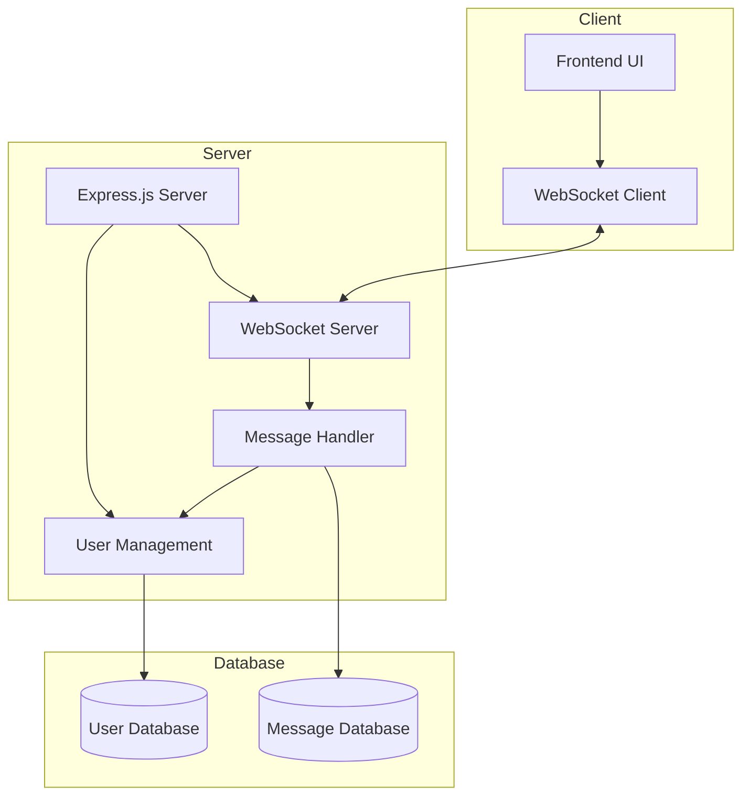
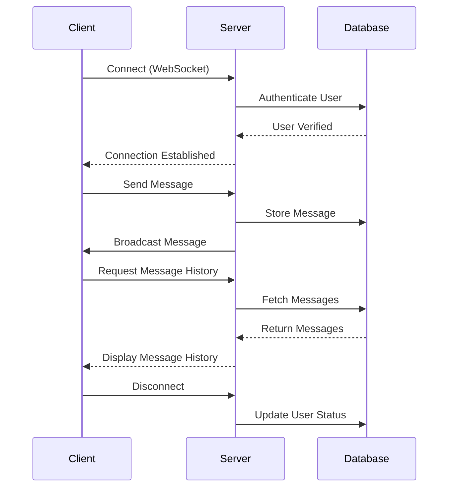
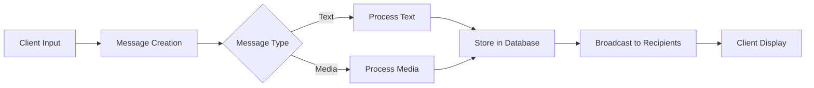

# Simple Chat App Architecture

## System Architecture

```mermaid
flowchart TD
    subgraph Client
        UI[Frontend UI]
        WSClient[WebSocket Client]
    end
    
    subgraph Server
        Express[Express.js Server]
        WSServer[WebSocket Server]
        MsgHandler[Message Handler]
        UserManager[User Management]
    end
    
    subgraph Database
        UserDB[(User Database)]
        MsgDB[(Message Database)]
    end
    
    UI --> WSClient
    WSClient <--> WSServer
    Express --> WSServer
    WSServer --> MsgHandler
    MsgHandler --> UserManager
    UserManager --> UserDB
    MsgHandler --> MsgDB
    Express --> UserManager
```

## Component Interaction

```mermaid
sequenceDiagram
    participant Client
    participant Server
    participant Database
    
    Client->>Server: Connect (WebSocket)
    Server->>Database: Authenticate User
    Database-->>Server: User Verified
    Server-->>Client: Connection Established
    
    Client->>Server: Send Message
    Server->>Database: Store Message
    Server->>Client: Broadcast Message
    
    Client->>Server: Request Message History
    Server->>Database: Fetch Messages
    Database-->>Server: Return Messages
    Server-->>Client: Display Message History
    
    Client->>Server: Disconnect
    Server->>Database: Update User Status
```

## Data Flow

```mermaid
graph LR
    A[Client Input] --> B[Message Creation]
    B --> C{Message Type}
    C -->|Text| D[Process Text]
    C -->|Media| E[Process Media]
    D --> F[Store in Database]
    E --> F
    F --> G[Broadcast to Recipients]
    G --> H[Client Display]
```
